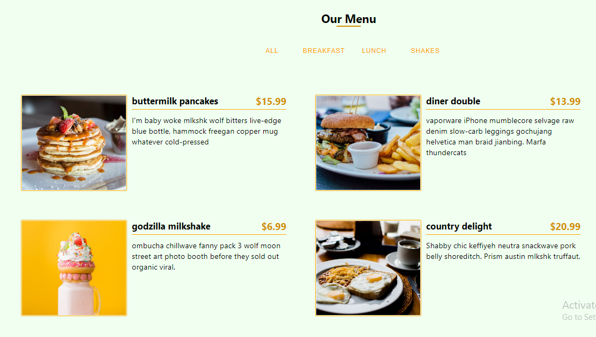
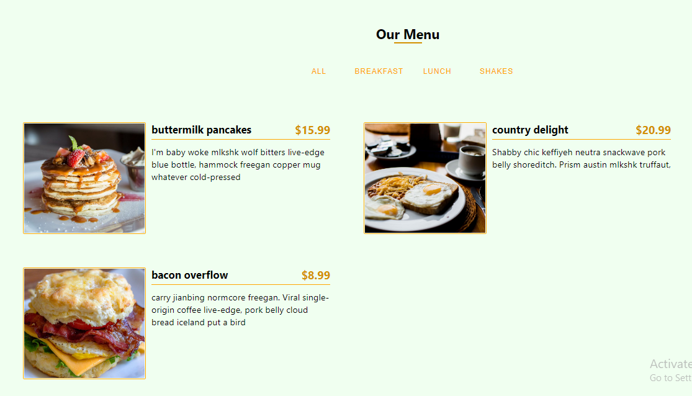
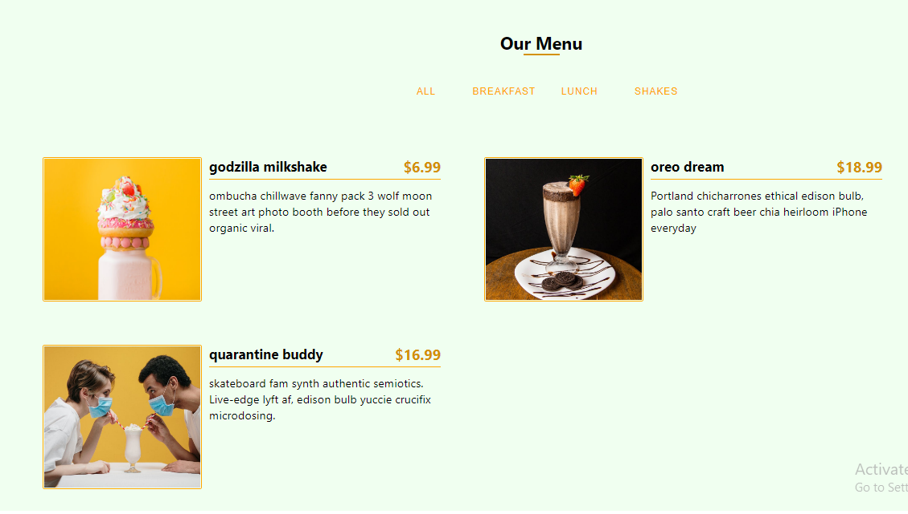
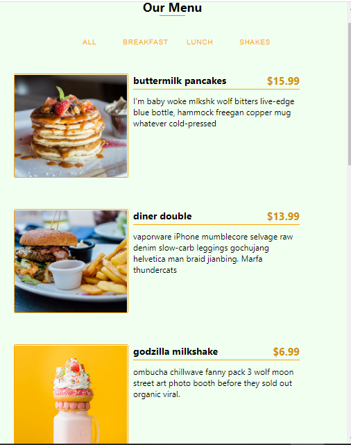

# Our-Menu

Another Minor React project completed during the course of my React learning, the project
title Our menu access the data stored locally in array and render the data to browser using
the react Library, there are several button, the all button is used to render all menus, while
the breakfast button is used to display only menus that falls under the category of breakfast.

the figure below represent the rendered page of the our menu web app.

# The first display page

# Breakfast Category page

# Shakes Category page

# Mobile view page

  
